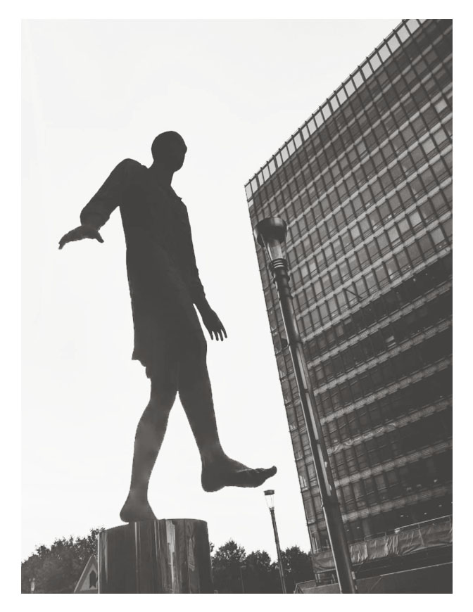

“_We don’t like planners here … that’s boring! … We do innovative stuff. We make things happen! … that’s not going to work. You should become one of us!_” These were the very first lines I was told in the first meeting with the head of the design lab I had then just joined. If I knew what I know now, I would have quit right there and then. But it was my first academic job and first encounter with HCI scholars. I was offered a three-year contract for working on projects in between planning and Human-Computer Interaction where, on paper, I could develop any project I wanted. 
So, someone telling me that they don’t like planners was not a deal-breaker for me. I, myself, found planners boring at that point. Even planners themselves say they do not like planners, that planners are too rational; they are too cautious; they are not open to different ways of doing things, and they block innovation.

What surprised me the most was that none of the things I had done to that point could qualify me as a ‘slightly cooler planner’! I had just finished a PhD on the use of games in planning, had designed games, and had a background in spatial analysis and data visualization …  I had tiptoed into the world of design and was there to embrace the creativity, innovation, and all that buzz! And there it was in my face: “The Boring Planner!” You might think this was just a particular incident in a particular lab. It is not! The more I dug into the works on planning and design, the stronger this pattern became. You would also think if designers knew about the tens of thousands of publications on possibilities and the ‘other ways’ in planning, they would not think of planners as boring … well, no! .. The more I tried to present the cool sides of planning to designers, the bigger the ‘boring planner’ label became, and the more I was pushed into doing things in the so-called ‘designerly way’ in that lab, the more I found myself, to my own surprise, defending planning.

It was as if there could not be any dialogue between the two fields on a deeper level; how we approach problems, how we think about the future, or what we add to each other on the higher level of matters. It seemed that one has to either willingly deny goodness in one field and take refuge in the other. Or yield to the classic ‘transactional’ interdisciplinary work; you need tools, I need theory; you need a method, I need a use-case; you give me something, I give you something back. For an observer, it would be too easy, yet acceptable, to blame this all on academia’s politics, power relations, individual personalities, or misunderstanding. We all have observed too many conflicts in our lives though to know that the peaceful transactions and finding the comfort zone in one familiar side are typical symptoms of a deep-rooted conflict that needs only a little trigger to unfold.

But what could possibly be the function of the ‘boring planner’ label in such conflict? There is a part in James Baldwin’s unfinished manuscript, ‘I am Not Your Negro’, where he writes:

"what white people have to do is try to find out

in their own hearts, Why it was necessary to have a nigger in the first place

Because I am not a nigger, I’m a man.

But if you think I’m a nigger, it means you need him […]

If I’m not the nigger here and you invented him, you the white people invented him,

then you’ve got to find out why.

And the future of the country depends on that,

whether or not it’s able to ask that question.”

Could the ‘boring planner’ then be there to satisfy the needs of the designers (or more specifically the Human-Computer Interaction (HCI) designers)? to justify the social turn in HCI or the hundreds of publications that start with lines like “planners/local authorities/planning officials have always struggled with participatory approaches/communication and tools hence we designed x and y” ?… if designers can exploit this stereotype to their benefit, have planners themselves used that label to justify the communicative turn or anything ‘innovative’ in planning? Is the ‘boring planner’ really a myth?

In this series of weblogs, I want to tell the story of this conflict and present parts of the history that answers whether there is any truth to the ‘boring planning’ or not! This will be about the history of decisions and decision making without relying on any specific disciplinary lens. It is about digging parts of history that would better explain why we are where we are and where we could possibly be … And just a little spoiler: Games will play a central role in this story!
